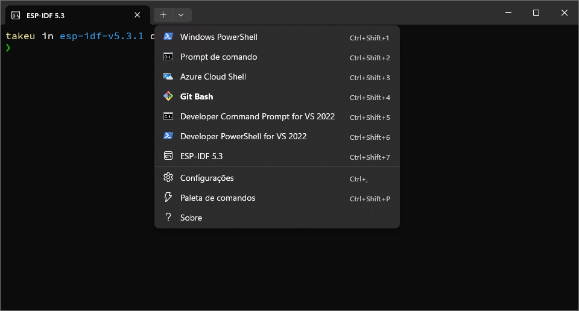

# ime-embarcados-lib

## Instalação e configuração inicial

### Ubuntu

#### 1. Instalando pré-requisitos

Execute o comando abaixo para instalar as dependências necessárias

``` bash
sudo apt-get install \
  git \
  wget \
  flex \
  bison \
  gperf \
  python3 \
  python3-pip \
  python3-venv \
  cmake \
  ninja-build \
  ccache \
  libffi-dev \
  libssl-dev \
  dfu-util \
  libusb-1.0-0
```

#### 2. Clonando ESP-IDF

Para desenvolver aplicativos para ESP32, é necessário instalar a sua framework de desenvolvimento oferecida pela **Espressif** no [repositório ESP-IDF](https://github.com/espressif/esp-idf).

Abra o terminal e execute

``` bash
mkdir -p ~/esp
cd ~/esp
git clone -b v5.2.1 --recursive https://github.com/espressif/esp-idf.git
```

para criar o diretório de instalação e clonar o repositório.

#### 3. Configurando tools

Além do ESP-IDF, é necessário instalar as tools utilizadas pelo ESP-IDF para projetos que suportam ESP32 (como compilador, debugger, pacotes Python, etc.)

Para isso, execute o comando

``` bash
cd ~/esp/esp-idf
./install.sh esp32
```

#### 4. Configurando variáveis ambientais

As tools instaladas ainda não foram adicionadas à variável de ambiente PATH. Para tornar as ferramentas utilizáveis na linha de comando, algumas variáveis de ambiente devem ser definidas. ESP-IDF fornece um script automatiza esse processo.

<!-- No terminal, onde vai usar o ESP-IDF, execute: -->
Execute, dentro de um diretório em que irá usar o ESP-IDF, o comando

``` bash
. $HOME/esp/esp-idf/export.sh
```

para configurar as variáveis de ambiente.

Para facilitar o uso frequente do ESP-IDF, recomenda-se a criação de um `alias`, que cria um atalho para o comando acima. Copie e cole o seguinte comando no perfil do seu shell *(.profile, .bashrc, .zprofile, etc.)*

``` bash
alias get_idf='. $HOME/esp/esp-idf/export.sh'
```

e reinicie o terminal. Agora você pode executar o comando `get_idf` para configurar as variáveis de ambiente automaticamente.

### Windows

#### 1. Instalando Git Bash

O **Git Bash** é um terminal que permite a execução de comandos do Git e de outros comandos do Unix no Windows. Baixe o Git Bash [neste link](https://gitforwindows.org/). Instale e configure em sua máquina de acordo com suas preferências.

#### 1.5 Instalando Windows Terminal (opcional)

O **Windows Terminal** é um emulador de terminal moderno e elegante. Baixe o Windows Terminal [neste link](https://apps.microsoft.com/detail/9n0dx20hk701?hl=pt-BR&gl=BR). Instale e configure  em sua máquina de acordo com suas preferências.

No Windows Terminal, é possível escolher o shell que você deseja utilizar. Dentre eles: Powershell, Prompt de Comando, Azure Cloud Shell, Git Bash e inclusive o próprio shell do ESP-IDF.



#### 2. Instalando ESP-IDF

O **ESP-IDF Tools Installer** é um instalador que automaticamente configura as ferramentas e variáveis de ambiente necessárias para o desenvolvimento de aplicativos para ESP32. Leia as instruções e baixe o instalador [neste link](https://docs.espressif.com/projects/esp-idf/en/latest/esp32/get-started/windows-setup.html#).

As variáveis de ambiente configuradas pelo instalador são:

- `$IDF_PATH`: caminho para o diretório do ESP-IDF
- `$Env:Path`: PATH do sistema, que inclui os diretórios do ESP-IDF

#### 3. Acessando ambiente ESP-IDF

Após instalar o ESP-IDF Tools, é possível acessar um shell do ESP-IDF pelo atalho criado no menu Iniciar. Execute o atalho (*ESP-IDF X.X PowerShell* ou *ESP-IDF X.X CMD*) ou selecione o perfil ESP-IDF X.X no  e aguarde a configuração do ambiente. Agora você pode executar comandos do ESP-IDF.

## Configuração do ime-embarcados-lib

Crie uma pasta que usará para seus projetos, navegue até ela e clone nosso repositório `ime-embarcados-lib` com o comando

``` bash
git clone --recursive git@github.com:viniciusfersil123/ime-embarcados-lib.git
```

e execute

``` bash
. $HOME/esp/esp-idf/export.sh
```

**OU** o alias correspondente

``` bash
get_idf
```

para configurar as variáveis de ambiente.

Ligue o ESP32 via USB em seu computador e execute

``` bash
ls /dev/tty*
```

para verificar a porta USB em que o ESP32 está conectado. Anote o nome da porta USB.

Execute

``` bash
idf.py set-target esp32
idf.py build
idf.py -p <PORT> flash
```

substituindo `<PORT>` pelo nome da porta USB em que o ESP32 está conectado (por exemplo `dev/ttyUSB0`). Se `<PORT>` não estiver disponível, o ESP-IDF tentará fazer o flash nas portas USB disponíveis.

*Obs.: Caso seu usuário não esteja autorizado a ler e escrever na porta USB referida, recomenda-se executar*

``` bash
sudo adduser <username> dialout
sudo chmod a+rw /dev/ttyUSB0
```

*substituindo `<username>` pelo seu nome de usuário.*


#### 4. Clonando ime-embarcados-lib

## Ligação do ESP32 com DAC

Para conectar o ESP32 com o DAC, ligue os pinos seguindo a tabela abaixo:

| ESP32  |DAC |
| ------------- | ------------- |
| 3V3  | 3V0  |
| GND | GND  |
| GPIO26 | WSEL  |
| GPIO25 | DIN|
| GPIO27 |BCLK  |
